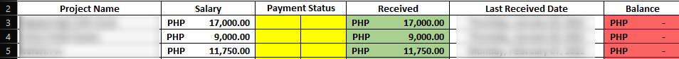
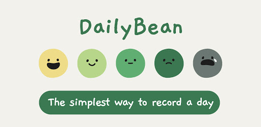
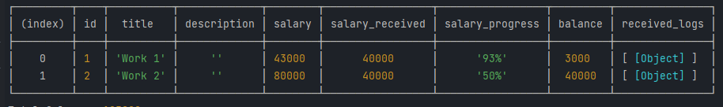

# Finance Goal Tracker Idea

This project entered in my mind when I'm doing my financial recording on Excel with basic stuff but pretty handy visualisation of my progress and goal.

I wanted to create this for myself, and hopefully someone can use this for their financial goal as well. This app is for personal and private use only, It will `not require you to connect your bank account or credit card` just input numbers there and the app will do the work for you.

## Ideas
1. Simple **cute character** that can be love by anyone liket this one below:
 
2. Different Themes

## Features

1. Finance goal visualization
2. Visualization of monthly income
3. Visualization of yearly income
4. Visualization of weekly expenses
5. History of expenses and income
6. Project count
7. Project balance and total balance
8. Google account integration
9. Theme product
10. Dark/Light mode

## Design goal

The goal of the design is to help you not to be lazy when adding your new project, income, or expenses in the web application, so you can keep on track and keep using the web app.

## Project Progress

####  EARLY
- [x] Back-end concept
  
- [ ] Project name and logo
- [ ] User-Interface and User-Experience
- [ ] Plan marketing strategy
#### MID
- [ ] No input ATM.

#### END
- [ ] No input ATM.

## Project Goals

- [ ] Complete web app in **December, 2022**.
- [ ] Deploy on its own domain and hosting.
- [ ] Market the project and make users.
- [ ] Monetize the project.
- [ ] Create mobile application of this project using `React Native`.
- [ ] Deploy the application on PlayStore.
